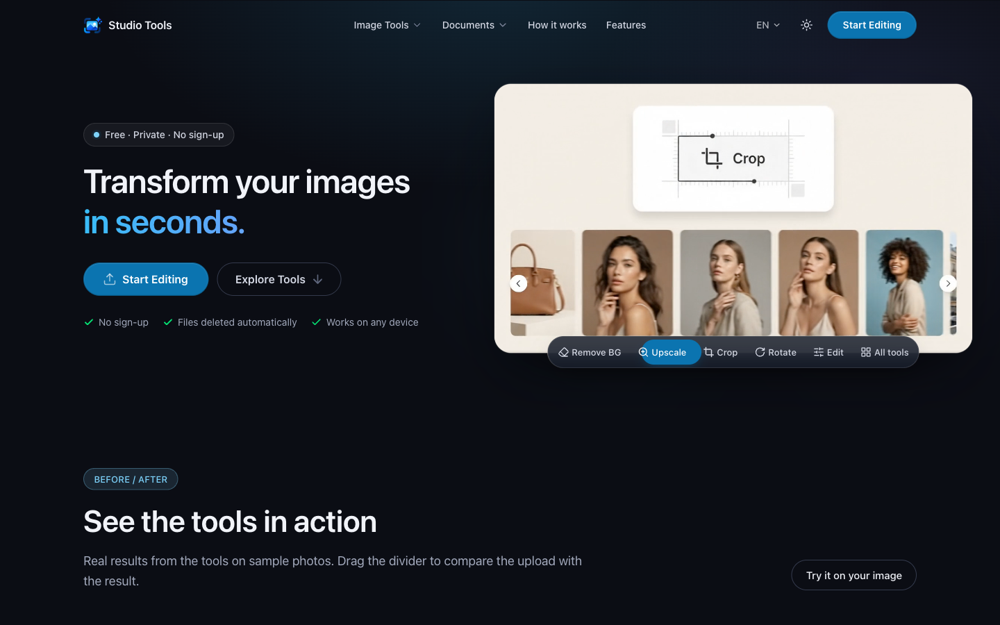
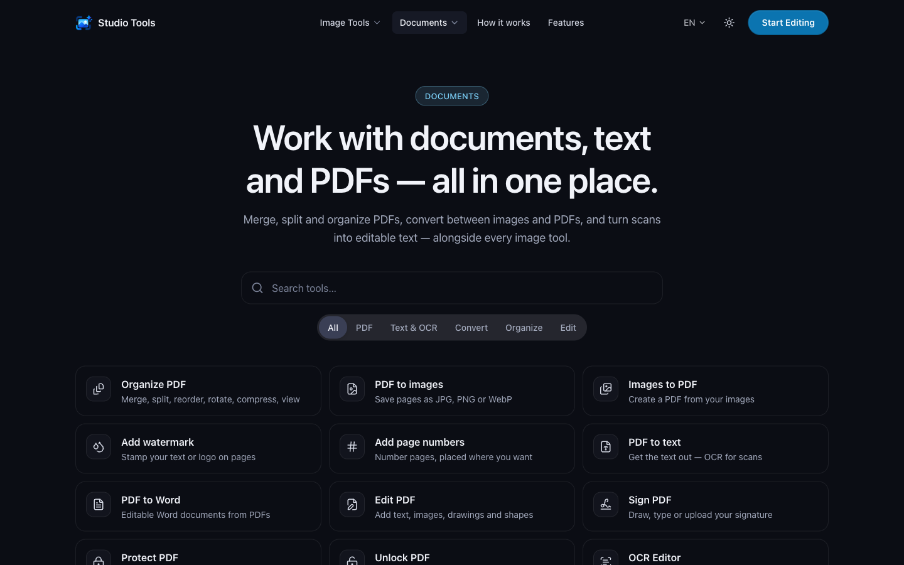
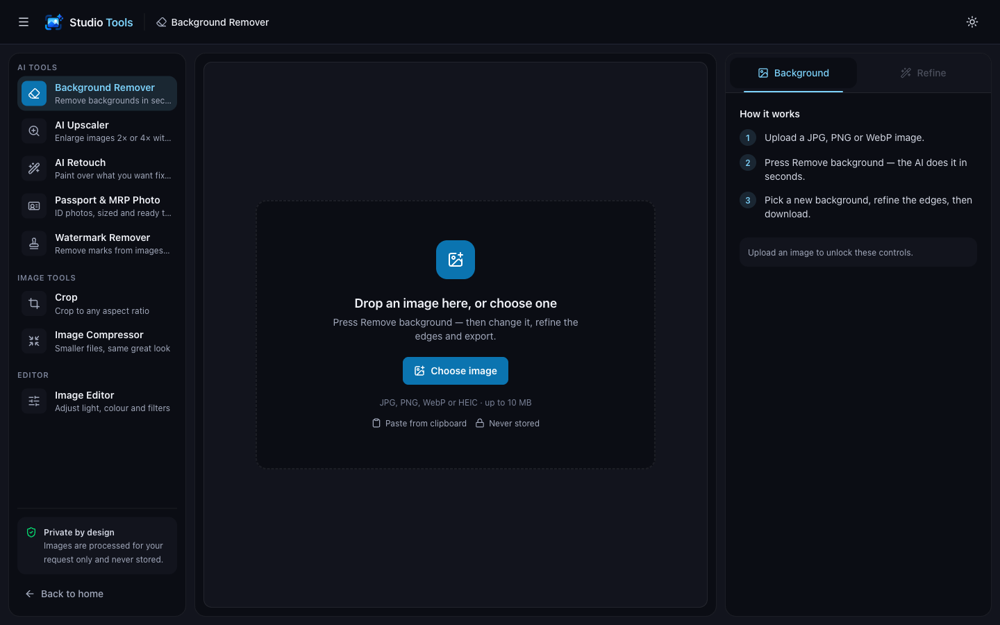
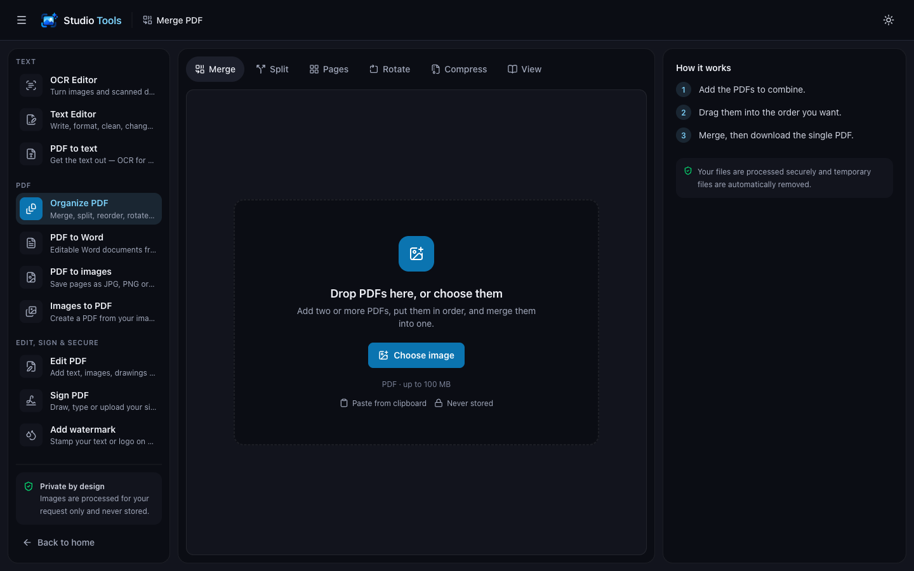
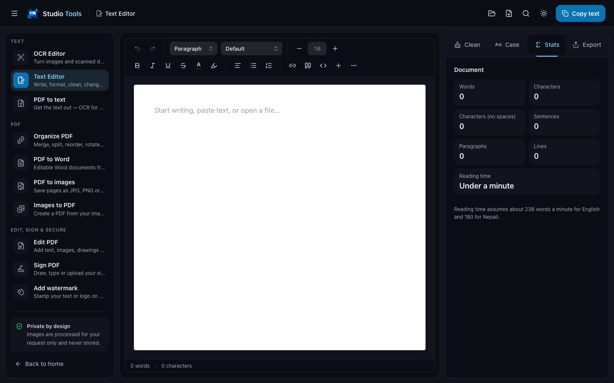

# Studio Tools

Free online image, PDF and text tools in one app: remove backgrounds, upscale with AI, make passport photos, read text from images (English and Nepali), and merge, split, edit, sign and convert PDFs. No sign-up, and uploaded files are deleted automatically.

**Live site:** https://imagetools-358n.onrender.com



## Screenshots

| Document tools | Background remover |
| --- | --- |
|  |  |
| **Merge PDF** | **Text editor** |
|  |  |

## Features

Every feature runs in one of three places:

- **Browser**: nothing is uploaded.
- **Node**: the Express backend.
- **Python**: the internal AI services that the backend starts itself.

| Feature | Browser | Node backend | Python |
| --- | --- | --- | --- |
| **Image tools** | | | |
| Photo Editor (light, colour, filters, resize) | Canvas | — | — |
| Crop (straighten, ratios, rotate/flip) | Canvas | — | — |
| Image Compressor | Upload, preview | sharp | — |
| Background Remover | Upload, preview | Queue | BiRefNet-Massive |
| AI Upscaler (2× / 4×) | Upload, preview | `upscayl-bin` (needs a GPU) | — |
| AI Retouch | Brush and mask | Built-in engine (sharp) | LaMa (optional, better results) |
| Watermark Remover | Brush, found areas | Removal via retouch | Detection (OpenCV) |
| Passport & MRP Photo | Presets, crop, sheet | Crop, resize, print sheet | Face detection, background, HEIC |
| OCR Editor | Editor | `tesseract` (fallback) | PaddleOCR |
| **PDF tools** | | | |
| PDF Viewer | pdf.js | — | — |
| Merge / Split / Organize / Rotate PDF | pdf.js thumbnails | pdf-lib | — |
| Images to PDF | Layout options | pdf-lib + sharp | — |
| Add Watermark / Page Numbers | Live preview | pdf-lib | — |
| Edit PDF / Sign PDF | Drawing layer, signature pad | pdf-lib | — |
| PDF to Images | Page picker | Jobs, ZIP download | PDFium |
| Compress PDF | Presets | Jobs | qpdf (pikepdf) |
| Protect / Unlock PDF | Password field | Jobs | pikepdf |
| PDF to Text | Result, export | Jobs, text cleanup | PDF text + PaddleOCR |
| PDF to Word | Preview, `.docx` export | Jobs, layout | PDF layout + PaddleOCR |
| **Text tools** | | | |
| Text Editor, Text Cleaner, Case Converter, Word Counter | Tiptap | — | — |

## Tech stack

| Part | Language | Main tools |
| --- | --- | --- |
| Frontend | TypeScript, CSS | React 19, Vite, Tailwind CSS 4, Untitled UI, React Router, Zustand, pdf.js, Tiptap |
| Backend | TypeScript | Node.js 20.6+, Express 5, sharp, pdf-lib, Multer, Helmet |
| AI services | Python 3.11–3.13 | FastAPI, PyTorch (BiRefNet-Massive), PaddleOCR, OpenCV, PDFium, pikepdf |

## Project structure

```text
studio_tools/
├── frontend/                     React app (Vite)
│   └── src/
│       ├── pages/                one folder per page (Home, Pdf, Text, Ocr, …)
│       ├── features/             tool logic (editor, documents, pdf-canvas, ocr, text, …)
│       ├── components/           ui/ (Untitled UI), layout/, common/, landing/
│       ├── lib/                  api client, constants (routes), seo
│       └── routes/               React Router config
├── backend/                      Express API
│   ├── src/
│   │   ├── routes/               all /api routes (routes/index.ts)
│   │   ├── controllers/          HTTP layer only
│   │   ├── services/             pdf/, compression/, retouch/, ocr/, photo-generator/, …
│   │   └── config/env.ts         every setting and its default
│   ├── python/image_service/     image + PDF service (BiRefNet-Massive, OpenCV, PDFium, pikepdf)
│   ├── python/ocr_service/       OCR service (PaddleOCR)
│   └── vendor/upscayl/           upscaler binary + models (installed by setup, git-ignored)
├── scripts/                      setup-ml.sh, check-processing.sh
└── docs/screenshots/             images used in this README
```

The browser only talks to our backend (`frontend → /api/* → backend → engine`). It never sees API keys or calls outside services.

## Run it locally

Requires Node.js 20.6+. The AI tools also need Python 3.11–3.13. The upscaler needs a Vulkan-capable GPU; Apple Silicon works.

```bash
npm install                          # root: installs concurrently
npm run install:all                  # frontend + backend packages
cp backend/.env.example backend/.env
scripts/setup-ml.sh                  # optional: Python services, models, upscaler (asks before downloading)
scripts/check-processing.sh          # optional: checks which engines are ready
npm run dev                          # backend on :5000, frontend on http://localhost:5173
```

In development, Vite forwards `/api` to the backend, so no CORS setup is needed.

> **macOS:** AirPlay Receiver uses port 5000. Turn it off (System Settings → General → AirDrop & Handoff), or set `PORT=5050` in `backend/.env` and `API_PROXY_TARGET=http://localhost:5050` in `frontend/.env`.

| Where | Command | What it does |
| --- | --- | --- |
| root | `npm run dev` | Runs backend and frontend together |
| root | `npm run build` | Builds both apps |
| `frontend` | `npm run build` | Type-checks, builds to `dist/`, writes SEO pages |
| `frontend` | `npm run lint` | Lints with oxlint |
| `backend` | `npm run dev` | API with hot reload (tsx) |
| `backend` | `npm run build` / `npm start` | Compiles to `dist/` / runs it |
| `backend` | `npm run typecheck` | Type-checks without building |

## Deployment (Render)

The live site runs as two Render services:

| Render service | Type | URL | Must set |
| --- | --- | --- | --- |
| StudioTools_Frontend | Static site | https://imagetools-358n.onrender.com | `VITE_API_BASE_URL=https://studiotools.onrender.com` |
| StudioTools_Backend | Node web service | https://studiotools.onrender.com | `FRONTEND_URL=https://imagetools-358n.onrender.com` |

- `VITE_API_BASE_URL` is built into the frontend's JavaScript. After changing it, use **Manual Deploy → Clear build cache & deploy**.
- `FRONTEND_URL` is the browser origin the backend allows (CORS). It must match exactly, with no trailing `/`. You can list several, separated by commas.
- Don't set `PORT` on Render. Render sets it.
- The backend is on Render's free plan, so it sleeps when idle. The first request after a while can take up to a minute.
- **Python on the free plan: the "lite" Docker image.** Render's Node runtime has no Python, so the backend runs from [`deploy/render/Dockerfile`](deploy/render/Dockerfile) (a Docker web service, build context = repository root). It fits in 512 MB by leaving the heavy AI out:
  - PDF to images, compress, protect, unlock, PDF to text/Word: full quality.
  - OCR: Tesseract (English and Nepali) instead of PaddleOCR.
  - Background removal and passport photos: off (`REMBG_MODEL=none`; the model alone needs ~400 MB).
  - Retouch and watermark removal: the built-in engine. Upscaling: off (needs a GPU).

  Everything runs at full quality on a machine with ~4 GB of memory using `scripts/setup-ml.sh`.

Check what the live backend can run: https://studiotools.onrender.com/api/health/processors

## Environment variables

**backend/.env**: every setting, with notes, is in [`backend/.env.example`](backend/.env.example). The main ones:

| Variable | Default | What it does |
| --- | --- | --- |
| `PORT` | `5000` | API port (local only) |
| `FRONTEND_URL` | `http://localhost:5173` | Allowed browser origin(s), comma-separated |
| `MAX_IMAGE_SIZE_MB` | `10` | Image upload limit |
| `DOCUMENTS_MAX_PDF_MB` | `100` | PDF upload limit |
| `REMBG_MODEL` | `bria-rmbg` | Background-removal model (see licences) |
| `UPSCAYL_MODEL` | `upscayl-standard-4x` | Upscaling model |
| `RETOUCH_PROVIDER` | `auto` | `auto`, `local`, `lama` or `iopaint` |
| `OCR_PROVIDER` | `auto` | `auto`, `paddle` or `tesseract` |

**frontend/.env** (optional)

| Variable | What it does |
| --- | --- |
| `VITE_API_BASE_URL` | Backend URL for production builds. Leave empty in development. Never put secrets in a `VITE_*` variable. |
| `VITE_SITE_URL` | The site's own address, for SEO links. Defaults to the one in the SEO config. |
| `API_PROXY_TARGET` | Where the dev server forwards `/api`. Defaults to `http://localhost:5000`. |

`.env` files are git-ignored; only the `.env.example` files are committed.

## API

All routes are under `/api` (see [`backend/src/routes/index.ts`](backend/src/routes/index.ts)).

| Area | Routes |
| --- | --- |
| Health | `GET /health`, `GET /health/processors` |
| Images | `POST /remove-background`, `/upscale`, `/retouch`, `/compress`, `/convert` |
| Watermark | `POST /watermark/detect`, `/watermark/remove` |
| Photo generator | `GET /photo-generator/presets`, `POST /photo-generator/process`, `/adjust`, `/sheet` |
| OCR | `POST /ocr` |
| PDF (jobs) | `POST /pdf/merge`, `/split`, `/organize`, `/to-images`, `/from-images`, `/compress`, `/watermark`, `/page-numbers`, `/to-text`, `/to-word`, `/protect`, `/unlock`, `/annotate` |
| Jobs | `GET /jobs/:id`, `GET /jobs/:id/files/:fileId`, `GET /jobs/:id/archive`, `DELETE /jobs/:id` |

PDF tools start a job (`202`) that the browser follows at `/jobs/:id`. Results are deleted after 30 minutes. Errors look like `{ "success": false, "message", "code" }`. More detail and curl examples: [backend/README.md](backend/README.md).

## Licences

Licences of the processing engines and models: [THIRD_PARTY_NOTICES.md](THIRD_PARTY_NOTICES.md).
